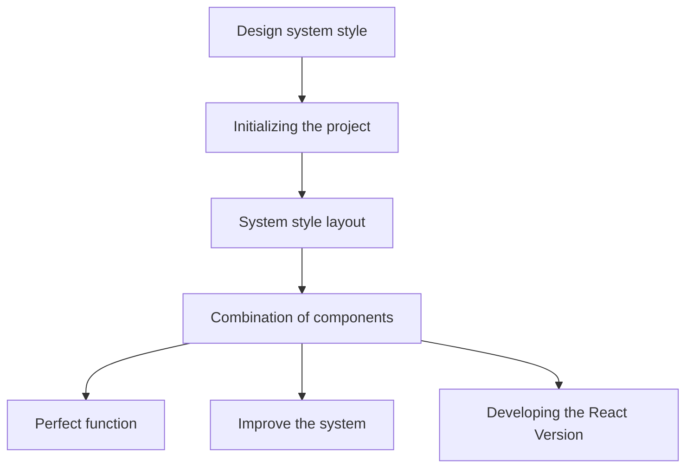

## General-management-system - 综合管理系统 

### Preface - 前言 🐺🐺
> 该方案作为一套多功能的后台框架模板,
> 适用于绝大部分的后台管理系统开发,
> 基于Vue3 + Vite + Typescript 开发的后台管理系统,
> 引用 Element - Plus 组件库,
> 方便开发，实现逻辑简单.     

> 开发环境 
>> Windows 11   
>> NodeJs  v16.18.0  
>> Vue     v3.2.37  
>> ViteJs  v3.1.0  

> 传送门
> > 我的个人博客  -- > [🚀🚀](http://kxdj.xyz)  


### Technology stack - 技术栈 🐼🐼   
   
    
   
    
    
    

    
### Development flow chart - 开发流程图 🎨🎨



### function - 功能 🕒🕒

-   [x] Element Plus
-   [x] vite 3
-   [x] Vue 3
-   [x] typescript
-   [ ] 登录/注销
-   [ ] Dashboard
-   [ ] 表格
-   [ ] Tab 选项卡
-   [ ] 表单
-   [ ] 图表 :bar_chart:
-   [ ] 富文本/markdown编辑器
-   [ ] 图片拖拽/裁剪上传
-   [ ] 权限管理
-   [ ] 三级菜单
-   [ ] 自定义图标
-   [ ] 待开发

### Installation - 安装 ⚡⚡

> 将模板下载在本地
```
git clone git@github.com:xxxtenson/General-management-system.git
```
> 进入模板目录
```
cd General-management-system 
```
> 安装项目依赖
```
yarn
```
```
npm install
```

> 项目运行
```
yarn dev
```
```
npm run dev
```

> 访问地址
```
http://127.0.0.1:5173/
```

### Vue Star History - Vue 历史 🚀🚀

[](https://star-history.com/#VUE/VUE&Date)

### Typescript Star History - Typescript 历史 🌟🌟

[](https://star-history.com/#Typescript/Typescript&Date)

#### Talk to the author - 探讨心得 💧💧


